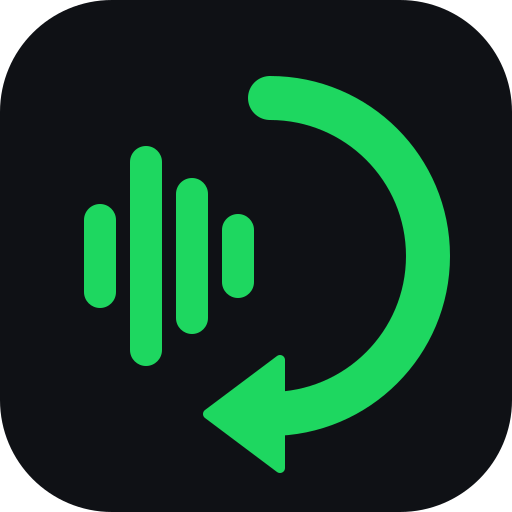

<div align="center">



# Syncify

**Get the songs Spotify doesn't have into Spotify, on every computer you use.**

[](https://github.com/RitvikNeerattil/Syncify/releases/latest)
[](#installation)
[](LICENSE)
[](https://ritvikneerattil.github.io/Syncify/)

</div>

Syncify is a small Windows app for unreleased tracks, leaks, live versions and anything else that isn't on Spotify. Search YouTube inside the app, pick the right upload, hit **Download**, and the song lands in your Spotify Local Files as a properly tagged mp3. Sign in with Google on your other computers and it shows up there too.

Syncify is **free and open source** under the [MIT license](LICENSE). No accounts, no servers, no tracking, and you can read every line of what it does.

- [Features](#features)
- [Installation](#installation)
- [Usage](#usage)
- [How sync works](#how-sync-works)
- [FAQ](#faq)
- [Roadmap](#roadmap)
- [Open source](#open-source)

## Features

- **Built-in YouTube search** with an inline preview, so you can pick the right upload without leaving the app. Pasting a link works too.
- **Best-quality audio** ripped with [yt-dlp](https://github.com/yt-dlp/yt-dlp) and saved as a 320k mp3.
- **Clean tags**: title, artist and year are guessed from the video (junk like `(Official Audio)` is stripped, and it figures out whether the upload is "Artist - Song" or "Song - Artist"). Fix anything before saving, or hit **Swap**. The thumbnail becomes square cover art.
- **Simple file names**: `Song Title.mp3`, nothing else.
- **Brings your existing songs along**: mp3s already in your music folder are added to your library and synced too.
- **Sync across computers** through a folder in *your own* Google Drive. Your PC can be off and your laptop still gets everything.
- **Edits and deletes sync too**, including renames.
- **Zero setup for tools**: ffmpeg and Deno are downloaded automatically on first launch.
- **Quiet background sync** when you log in to Windows.

## Installation

1. Download **`Syncify.exe`** from the [latest release](https://github.com/RitvikNeerattil/Syncify/releases/latest).
2. Put it anywhere and double-click it.

That's it. On first launch Syncify downloads ffmpeg and Deno (about 130 MB, once) in the background.

> [!NOTE]
> Windows SmartScreen may warn about an unrecognized app since the exe isn't code-signed. Click **More info → Run anyway**.

## Usage

**First launch** walks you through three steps:

| Step | What to do |
|---|---|
| 1. Sign in with Google | Approve in your browser. Syncify can only see files it creates in your Drive. |
| 2. Pick a music folder | Defaults to `Music\Syncify`. Downloaded songs go here. |
| 3. Add it to Spotify | Spotify → Settings → Your Library → turn on **Show Local Files** → **Add a source** → pick the folder. |

**Downloading a song**

1. Search on the **Search** tab.
2. Click a result to preview it and see the guessed tags.
3. Fix anything that's off, then hit **Download**.

The song appears under **Local Files** in Spotify, and on your other computers the next time Syncify syncs.

**Other computers**: install Syncify, sign in with the same Google account, pick a music folder. Your library gets pulled in automatically.

## How sync works

```
 PC                              Google Drive                          Laptop
┌───────────────────┐      ┌────────────────────────────┐      ┌───────────────────┐
│ Music\Syncify\    │ ───▶ │ Syncify/                   │ ───▶ │ Music\Syncify\    │
│   Song.mp3        │      │   Song.mp3                 │      │   Song.mp3        │
│                   │ ◀─── │   _sync/catalog-<pc>.json  │ ◀─── │                   │
└───────────────────┘      │   _sync/catalog-<laptop>…  │      └───────────────────┘
                           └────────────────────────────┘
```

- Syncify creates a `Syncify` folder in your Google Drive and only ever sees files it created (the `drive.file` permission).
- Each computer publishes its own song list. For every song, **the newest change wins**, so adds, tag edits, renames and deletes all carry over.
- If a song's file hasn't reached Drive yet, the other computer re-rips it from the saved YouTube link.
- Deleted songs go to a trash folder on your computer, and old versions in Drive are moved to Drive's trash after a day.
- Sync runs on launch, every 10 minutes while the app is open, right after each download, and at Windows login.

## FAQ

<details>
<summary><b>Does the developer get my data?</b></summary>

No. There are no Syncify servers. Everything goes directly between your computer, YouTube and your own Google Drive. See the [privacy policy](https://ritvikneerattil.github.io/Syncify/privacy.html).
</details>

<details>
<summary><b>How much Drive space does it use?</b></summary>

About 8 MB per song, from your own 15 GB of free Google storage (shared with Gmail and Photos).
</details>

<details>
<summary><b>The tags are wrong.</b></summary>

Tags are guessed from the video title, since leaks rarely have real metadata. If title and artist are flipped, hit **Swap**. You can fix anything in the form before downloading, or later from the **Library** tab. Edits sync to your other computers.
</details>

<details>
<summary><b>Downloads stopped working.</b></summary>

YouTube changes things often. Check **Settings → Tools** that ffmpeg and the JS runtime are green, and update to the latest Syncify release (each build bundles the newest yt-dlp). The log is at `%APPDATA%\Syncify\syncify.log`.
</details>

<details>
<summary><b>Where does Syncify keep its own files?</b></summary>

Settings, the song list, the log and the trash live in `%APPDATA%\Syncify`. Your Google sign-in is stored in Windows Credential Manager. Your music folder only ever contains mp3s.
</details>

## Roadmap

- [ ] Android app (sign in with Google, pull from the same Drive folder)
- [ ] Cover art thumbnails in the Library view
- [ ] Playlists
- [ ] Code-signed releases (no more SmartScreen warning)

## Open source

Syncify is released under the [MIT license](LICENSE). Bug reports and ideas are welcome in [Issues](https://github.com/RitvikNeerattil/Syncify/issues). If you want to build it yourself or contribute code, see [DEVELOPMENT.md](DEVELOPMENT.md).

Syncify stands on [yt-dlp](https://github.com/yt-dlp/yt-dlp), [ffmpeg](https://ffmpeg.org), [Deno](https://deno.com), [mutagen](https://github.com/quodlibet/mutagen) and [pywebview](https://github.com/r0x0r/pywebview).

## Disclaimer

Syncify is for personal listening. Downloading from YouTube is against YouTube's terms of service, and you're responsible for respecting copyright. Don't use Syncify to share or sell anyone's music.
